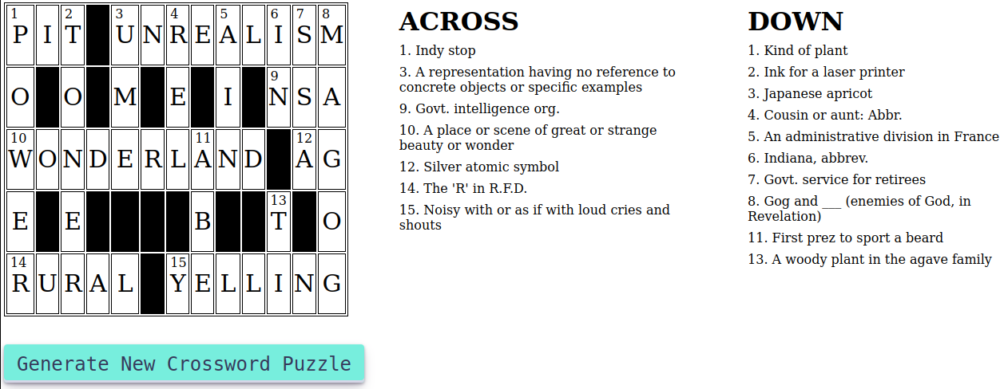

# Crossword Puzzle Generator

Browser-based Javascript program to create crosswords.

The crossword generated is a rectangular grid containing lettered and black squares along with a list of clues. 
The lettered squares form horizontal and vertical answers that match the given clues.
A valid crossword is obtained when all of the cells are filled.

NOTE: this program does not solve puzzles, it generates them.

To use, simply open cw.html in a modern browser, which brings in all other files to dynamically generate a dense crossword puzzle.

## License
MIT. Use the code freely.

## Staus - version 0.0.1
- Full-sized dense crossword puzzles
- Run completely in a modern browser
- Multiple board templates
- Real words and challenging clues
- Quick and easy to use

## Getting Started
Download all of the files and open "index.html" in any browser that supports Javascript/ECMAscript.
The HTML file includes its support files from the current directory.

The dictionary (words.js) is a JSON file of over 70,000 English words/clues.
New clues can be easily added by using any text editor.
Other languages can be used instead.

## Overview of the project

This project generates crossword puzzles, not solve them.
The board for the puzzle is randomly selected from board patterns.
More framesboards can be added easily.

This project generates **dense** puzzles, like the puzzles often seen in newspapers.
Dense puzzles are much harder to generate than sparse puzzles because words are adjacent.
In general, the crossword construction problem is NP-complete.
The computational complexity for dense puzzles is proably higher than chess, too, because the number of choices for word placement is much higher than the number of legal chess moves. 
Assuming for each entry there are 1,000 possible words in the database and only 50 can be used.
Then in order to fill 30 words, we need to perform 50 ^ (30-1) iterations.
> any theorist want to do a proof of this complexity supposition?

Crosswords are a type of constraint satisfaction problem.
The program attempts to completely fill in the crossword board.
The code uses backtracking when searching through all possible moves.
Backtracking solves problems recursively by trying to build a solution incrementally, one word at a time, by removing those solutions that fail to satisfy the constraints.

Generating a dense puzzle is computationally very challenging.
The current version generates a complete puzzle in less than a second.
If no word fits into a space, the clue lists the internal index number and the length of the space, eg "[LEN 3]".

Although the crossword construction problem is NP-complete, heuristics can be used to solve the problem efficiently for small grid sizes and large dictionaries. 

## Architecture generations

  * **Version 1**:
The first approach used Brute Force and randomness to place words.
This naive approach tries all combinations of filling in the grid with words from the dictionary.
Unfortunately, while this is computationally efficient, not all puzzles can be solved.
When a solution is blocked, it is common to backtrack repeatedly, sometimes endlessly.

    While approach #1 mostly succeeded, its failures were very costly
because the code could get into an endless loop of trying.
Overall success was over 80%.

 * **Version 2**:
The second approach uses backtracking with dependencies:
>     Pick a starting word.
>     while (Puzzle is not finished)
>      For each path from the starting word.
>         check if selected path is safe, if yes select it
>         and make recursive call to rest of the puzzle
>         If recursive calls returns true,
>           then return true.
>         else
>           undo the current move and return false.
>      End For
>     If none of the moves work out, return false, NO SOLUTON.

    Backtracking improved the success rate to about 90%, but the complexity level grew very quickly.
Time Complexity of our Backtracking approach: O((M * P)^D)
>     where:
>     N is the number of continous row/columns of empty cell
>       (word to be filled) in the grid,
>     M is the average length of a word,
>     P is the lists of possible word to be tested for the crossword
>       constraint,
>     D = intersection point(s) between horizontal and vertical words.

 * **Version 3**:
Instead of backtracking, this version attempts to fix words that failed.
Each failed word looks at intersecting words to find pairs that fit.
The success rate was improved while the generation remained very fast.

 * **Version Future?**:
Instead of filling in a complete word and then trying to fit crossing words, this approach tries to fill in single letters by negotiating between the crossing words.
This approach is much finer-grained, so mismatched words should be fewer.

